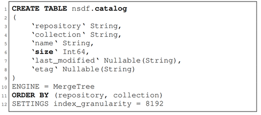
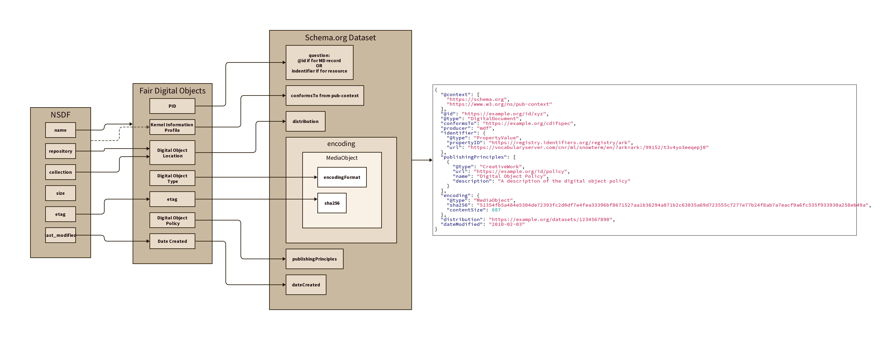
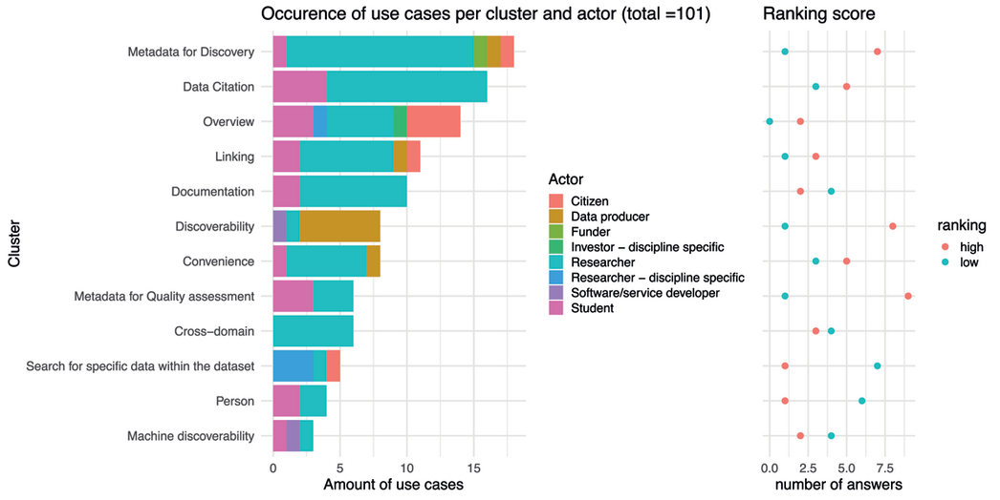

# Work

## Introduction

The publication NSDF-Catalog: Lightweight Indexing Service for Democratizing Data Delivering [1] expresses one of the goals for NSDF-Catalog as:

"a lightweight indexing service with minimal metadata that complements existing domain-specific and rich-metadata collections." 

Additionally, the publication goes on to detail further goals of;

(i) coordinate data movements and replication of data from origin repositories within the NSDF federation; 
(ii) build an inventory of existing scientific data to inform the design of next-generation cyberinfrastructure; 
(iii) provide a suite of tools for discovery of datasets for cross-disciplinary research.

This document provides some possible directions to connect this publication's goals with work taking place globally to build the web of data.

## Alignment to Existing Work

Globally, works related to recommendations  such as the W3C Data on The Web Best Practices [2], W3C Linked Data Platform [3] and the FAIR principles [4]  are  taking place.  Several of these offer possible collaborative connections with NSDF-Catalog.   

Projects with leverageable connections, both technical and social, include:

* Committee on Data (CODATA) of the International Science Council (ISC) Cross Domain Integration Framework (CDIF),  a European Commission funded WorldFAIR project
 
* DeCODER, an NSF funded project
 
* Ocean InfoHub (OIH), part of the UNESCO Ocean Data and Information System (ODIS).  OIH also has collaborative ties with the Australian Research Data Commons (ARDC) and the German Helmholtz group.
 

## Activities

The following are possible activities connecting the NSDF-Catalog goals and the above projects.  These are presented as a starting point for discussions with the NSDF-Catalog team and are aligned to FAIR principles.  Additionally, establishing early one set of use cases to drive the development work is vital.  

* Findability: Review web architectural patterns being evaluated in CDIF to improve the findability of NSDF-Catalog data. Consider leveraging these patterns to facilitate the connection between NSDF-Catalog with DeCODER and OIH.

* Accessibility: Develop a standardized metadata representation by crosswalking the NSDF-Catalog metadata schema with the FAIR Digital Objects schema and connecting that with the Schema.org vocabulary to improve the accessibility of NSDF-Catalog data to KGs leveraging Schema.org.

* Interoperability: Review NSDF-Catalog metadata in the context of DeCODER and Ocean InfoHub profiles to identify potential alignments and augmentation that improve the interoperability of NSDF-Catalog data and strengthen connections between NSDF-Catalog resources and the data resources exposed by DeCODER and OIH knowledge graphs.

* Reusability: Enhance the discoverability of NSDF-Catalog data by exploring ways to connect it with domain-specific knowledge graphs such as DeCODER and Ocean InfoHub, improving the reusability of the data.

## References:

[1] J. Luettgau, et al., "NSDF-Catalog: Lightweight Indexing Service for Democratizing Data Delivery," in 2022 IEEE/ACM 15th International Conference on Utility and Cloud Computing (UCC), Vancouver, WA, USA, 2022 pp. 1-10.

[2] Data on the Web Best Practices. (2017). Retrieved 10 April 2023, from https://www.w3.org/TR/dwbp/

[3] Linked Data Platform 1.0. (2015). Retrieved 10 April 2023, from https://www.w3.org/TR/ldp/

[4] Wilkinson, M., Dumontier, M., Aalbersberg, I. et al. The FAIR Guiding Principles for scientific data management and stewardship. Sci Data 3, 160018 (2016). https://doi.org/10.1038/sdata.2016.18

## Appendix

This section presents further details on potential work proposed in the main body Activities section.  All items presented here are subject to change as discussions evolve between the parties.  It is presented more as reference.

### Activity 1: Web Architectural Patterns

Many of the approaches presented use web architecture as their foundation.  The web is designed to aid scaling at many levels and is one of the most robust networks.   However, for the high speed exchange of billions or even or even more items there are less common elements of the architecture that may need to be leveraged.  

These include elements of the HTTP 2.0 protocol such as XYZ.   Additionally, approaches that convey relation information in the HTTP request response of HEAD calls are documented.  

Such approaches could also be used to quickly convey PID graph-like elements between parties to exchange linking identifiers of use in larger domain focused Knowledge Graphs.

#### Level Details
The following section details L1, L2, L3.  There is a possible level 0 (L0), that describes the use of robots.txt and sitemap.xml approaches.

L1:  Structured data on the web with JSON-LD encoded RDF in script tags accessed by HTTP.  One option here is the use of content negotiation to obtain the JSON-LD directly without the need for the consumer to parse it.  

L2:  Signpost style link headers in the HTML.  This would allow the addition of things like type and ldp#constrainedBy like link headers.  Note this later is likely a bit of cheating, and we should look to the proper IANA Link headers for the list.  Valid terms of interest might be: described by, describes, profile, 

L2.1 Why not place link info in the HTTP header?   The effort required to do this seems high for  providers and, less so,  consumers.  While it does offer some efficiency, it might not be that much since it is likely the consumers want the full datagraph to form a KG with, not simple link relations between resources.   Though the latter might be enough for the PID graph ecosystem.  A review of the Ocean InfoHub Graph related to this in found in the append section OIH Link Review

L3:  Content Negotiation by Profile: This level would require more effort both on the part of the provider and consumer.  It would likely not be an approach a high percentage of the community could implement.   It would provide a rich environment for the passing of community defined profiles and constraints.  

### Activity 2:  Metadata Crosswalks

The exchange of structured metadata in the form RDF encoding in JSON-LD leveragin the Schema.org vocabulary is an emerging method for the exchange of dataset centric metadata [5].   

As an exchange and integration format, especially for domain knowledge graphs, the RDF data model is a valid approach.  Generating a representation of the NSDF-Catalog database entity relations in RDF via the Schema.org vocabulary is a first step toward connections with groups like DeCODER and Ocean InfoHub.  Also, mapping to the FAIR Digital Object metadata kernel also provides an exchange checkpoint.  

National Science Data Fabric (NSDF)
 The following table from the NSDF-Catalog document provides guides for the schema.

NSDF Required Properties:  repository, collection, name, size, last_modified, etag

#### FAIR Digital Object

In FDOF, we have an identifier record named FDOF's Identifier Record (FDOF-IR), a specific type of metadata, containing information about: the object's type; the object's metadata record(s); and the object's location(s). More details on this can be found in FAIR Digital Object Framework Documentation
From the FDO – Kernel Attributes & Metadata Version 2.0  we can extract the required items as denoted by a required cardinality of 1 or more.  

**Required Properties:**  PID, KernelInformation Profile, digitalObjectType, digitalObjectLocation, digitalObjectPolicy, Etag, dateCreated

A draft mapping from NSDF to FDO to schema.org can be seen below with draft connections between the properties.  In some cases these are not semantically valid, such as last modification times linked to date created times.  

It would be a good exercise to explore mapping these connections via something like SSSOM (https://github.com/mapping-commons/SSSOM).  

### Activity 3:  Profile alignment and KG completion
Building on the data model work in Activity 2, we can begin to review connections to domain models like those used in DeCODER or OIH.   In order to do this we may need to augment data either or both of the parties data holdings, perhaps through file inspection to get at things such as variable, spatial or temporal properties. It would be work inspecting the provider list at https://nationalsciencedatafabric.org/catalog3d.html to generate a feel for the landscapes use of structure data already.

* Survey providers for NSDF
	* Several are using JSON-LD Schema.org Dataset already
* See if some align conceptually with groups such DeCODER or OIH
	* Here is where SHACL or JSON-LD framing could be leveraged.  These could be used in a Dask style approach as done in previous work if possible. 
* Evaluate use of distribution inspection to fill out some of the metadata to form linkages
	* This would be looking at inspection for variable, spatial and temporal properties that can map to SDO properties. 
	* Also evaluate the use of SOSA and SSN to represent these

This provides an environment where one can begin using JSON-LD Framing and the W3 SHACL language to explore gaps in data structures needed to facilitate integration goals.  These goals might be simple resource connections or they might be more complex uses in search or retrieval queries.  

### Activity 4:  Query and API connections for platforms and UI

Once connections are established with DeCODER and OIH, exploring patterns to leverage these connections will be next.  These might include the integration of results in the search platforms.

As part of the CODATA work, methods of integrating APIs and linked open data platforms are being discussed.   Approaches like GraphQL are also being evaluated for its potential to offer a bridge between graph and API patterns.  

#### Researcher Needs and Cautionary Exploration

As a brief aside it is interesting to explore NSFD-Catalog findings with some of the researcher and metadata observations being published.   Additionally, the publication by Mayernik and Liapich provides an important gut check on the utility of FAIR in addressing interoperability.  

In reference [6], the text discusses various clusters of ideas found when analyzing data discovery use cases. Key clusters include data citations, overview, metadata, documentation, discoverability, convenience, linking, quality, cross-domain, searching within the dataset, person, and machine discoverability. The main actors involved are researchers and students, with data producers being particularly concerned about discoverability. 

Fig X: From Ref Mahiak showing one assessment of needs or interest

Reference [7] provides some caution and reflection on leveraging FAIR.  The study examines metadata schema and controlled vocabulary use in Earth system science data facilities, assessing community consistency and implications for FAIR principles. Although some consistency is observed, no single standard is used by more than 42% of facilities. DOIs are displayed in over 50% of facilities, suggesting DataCite metadata schema as the most widely used. The research questions the ability of metadata standards and keyword vocabularies to facilitate interoperability in the Earth system science data community and highlights the challenges of migrating to new standards. The only vocabulary with significant use is the NASA Global Change Master Directory (GCMD). The study also reveals that compliance with FAIR principles does not necessarily lead to interoperability, prompting further investigation into the practical role of FAIR principles in data facility operations.

### References:

[5] Dan Brickley, Matthew Burgess, and Natasha Noy. 2019. Google Dataset Search: Building a search engine for datasets in an open Web ecosystem. In The World Wide Web Conference (WWW '19). Association for Computing Machinery, New York, NY, USA, 1365–1375. https://doi.org/10.1145/3308558.3313685

[6] Mathiak, B., Juty, N., Bardi, A., Colomb, J., & Kraker, P. (2023). What are Researchers’ Needs in Data Discovery? Analysis and Ranking of a Large-Scale Collection of Crowdsourced Use Cases. Data Science Journal, 22(1), 3. DOI: http://doi.org/10.5334/dsj-2023-003

[7] Mayernik, M & Liapich, Y. (2022, 12 19). The Role of Metadata and Vocabulary Standards in Enabling Scientific Data Interoperability: A Study of Earth System Science Data Facilities. Journal of eScience Librarianship 11(2) :1-18. doi: 10.7191/jeslib.619

